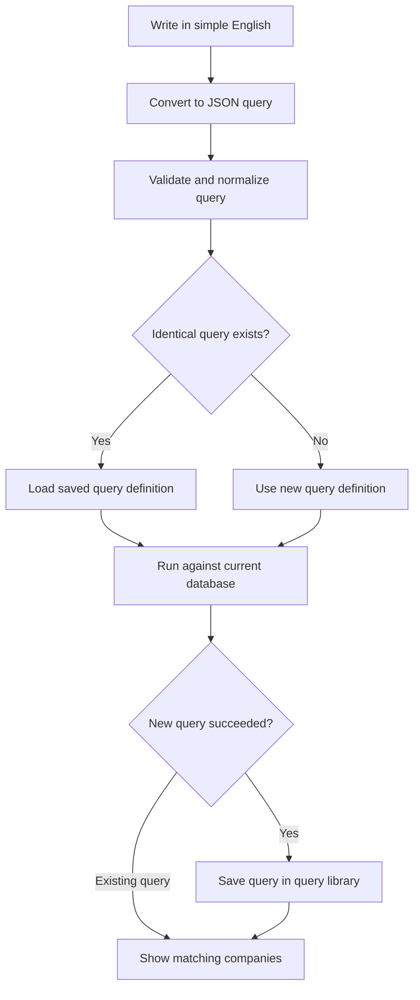

# Scrooner: Natural Language Screening and Query Library

## Goal

Let a user describe a stock screen in simple English. Convert that request into a structured JSON query, check whether the same screen already exists, and show matching companies.

This document turns the supplied diagram into a proposed implementation flow. The validation and reuse rules below clarify details that are not specified in the drawing.

## User journey

1. The user writes a request in simple English.
2. Scrooner converts the request into a structured JSON query.
3. Scrooner checks the query library for an identical or similar query.
4. If an identical query exists, Scrooner opens its screen and loads results using current database data.
5. If no identical query exists, Scrooner validates the new query and runs it against the database.
6. After successful execution, Scrooner saves the reusable query definition in the query library.
7. Scrooner shows a screen containing the matching companies and the applied filters.

## Workflow



Validation or execution failures should return a clear error or clarification request. They should not create a reusable query entry.

## Example

**User request:** “Show US technology companies with a market cap above $10 billion and a P/E ratio below 25.”

**Illustrative JSON query:**

```json
{
  "schema_version": 1,
  "universe": "us_stocks",
  "filters": {
    "logic": "and",
    "conditions": [
      { "field": "sector", "operator": "eq", "value": "Technology" },
      { "field": "market_cap_usd", "operator": "gt", "value": 10000000000 },
      { "field": "pe_ratio_ttm", "operator": "gt", "value": 0 },
      { "field": "pe_ratio_ttm", "operator": "lt", "value": 25 }
    ]
  },
  "sort": { "field": "market_cap_usd", "direction": "desc" }
}
```

Field names are illustrative and must map to Scrooner's actual data schema. This example uses a positive trailing P/E ratio to exclude loss-making companies. Show that interpretation to the user so they can edit it. Missing P/E values do not match these conditions.

## Query library behavior

| Match type | Behavior |
| --- | --- |
| Identical normalized query | Reuse the existing definition and execute it using current data. |
| Similar query with different filters or values | Suggest it as an alternative. Execute the user's requested query unless they choose the suggestion. |
| No match | Execute the validated new query and save its definition after success. |

Different wording can represent the same query. For example, “market cap above $10 billion” and “market capitalization greater than $10B” should normalize to the same filter.

Normalize units, supported field names, operators, and condition order before creating an exact-match fingerprint. Preserve differences that affect meaning, including AND/OR logic, thresholds, metric periods, stock universe, and sorting.

Similarity search can help users discover existing screens, but similarity alone must not substitute different screening criteria.

## What to store

| Field | Purpose |
| --- | --- |
| Query ID | Stable identifier for the reusable query. |
| Title | Readable screen name. |
| Original request | The input that created the query, subject to privacy rules. |
| Canonical JSON | Validated query definition. |
| Query fingerprint | Exact-match lookup and deduplication. |
| Schema version | Compatibility with future query format changes. |
| Created and updated timestamps | Query history. |

Store query definitions separately from company results. Reusing a query should not imply reusing stale results. Any results cache should have an explicit freshness policy tied to data updates.

## Execution requirements

- Validate JSON against a strict schema before execution.
- Allow only supported fields, operators, units, and sort options.
- Translate validated JSON into parameterized, read-only database queries on the backend.
- Apply query timeouts, pagination, and result limits.
- Ask for clarification when the request is ambiguous or uses an unsupported metric.
- Display the interpreted filters so users can verify and edit them.
- For zero matches, show an empty state with the applied filters and options to edit them.
- Deduplicate identical queries even when multiple users create them simultaneously.
- Do not expose personal requests or private screens through a shared query library.

## Query reuse versus a user's saved screen

The query library stores reusable screening logic. A user's saved screen stores their personal reference to that logic, including their chosen name and preferences. Creating a reusable query entry does not automatically add it to the user's saved screens.

## MVP acceptance criteria

1. A supported plain-English request produces valid JSON and matching company results.
2. Equivalent requests reuse one canonical query definition.
3. Similar requests with different thresholds retain their own criteria.
4. Reopening a screen reflects current data under the defined freshness policy.
5. Invalid, ambiguous, failed, and zero-result queries each have a clear user-facing state.
6. Users can inspect the applied filters before saving their personal screen.
